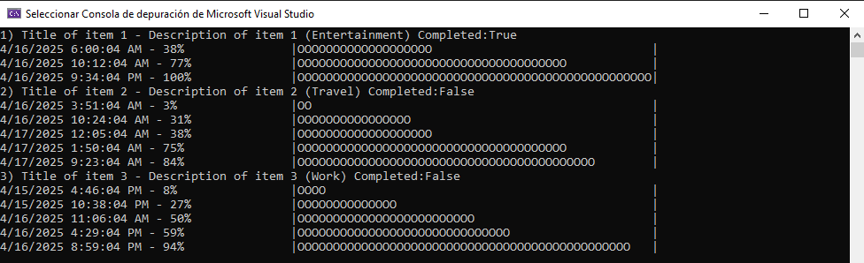

# BEYOND - EJERCICIO PRÁCTICO

Este repositorio contiene la solución completa al ejercicio técnico. Se han resuelto todos los casos planteados, tanto los obligatorios como los opcionales. Todo el código y los comentarios están escritos en inglés.

## 📁 Estructura del Proyecto

La solución está organizada de forma modular y por capas. Algunos proyectos son compartidos tanto por la aplicación de consola como por la API web.

### Proyectos Comunes

- **`Beyond.Domain`**  
  Contiene toda la lógica del dominio. Sigue los principios de Domain-Driven Design (DDD), asegurando un dominio independiente del resto de las capas.

- **`Beyond.Infrastructure`**  
  Contiene la lógica de infraestructura, como repositorios o servicios auxiliares.

### Proyecto de Tests

- **`Beyond.Domain.Test`**  
  Proyecto de pruebas unitarias que valida el comportamiento del dominio.

### Aplicación de Consola

- **`Beyond.Domain.Console`**  
  Aplicación ejecutable por consola desarrollada con .NET 8, que utiliza la lógica del dominio para realizar operaciones desde terminal.

  

### API Web

- **`Beyond.Web.Server`**  
  Aplicación Web API desarrollada con .NET 8. Expone los endpoints necesarios para consumir la lógica del dominio vía HTTP.

### Aplicación Cliente (SPA)

- **`beyond.web.client`**  
  Proyecto desarrollado con React + JavaScript. Es una SPA (Single Page Application) que consume la API REST para mostrar y gestionar los datos de forma dinámica.

## ⚙️ Consideraciones Técnicas

- Se ha seguido una arquitectura basada en DDD (Domain-Driven Design), separando claramente las responsabilidades de cada capa.
- El proyecto `Beyond.Domain` es completamente independiente y puede ser reutilizado sin depender de infraestructura ni de tecnología específica.
- El agregado `TodoList` ha sido diseñado como entidad raíz y contiene su propio identificador, siguiendo buenas prácticas de DDD.
- Las entidades y los value objects están diseñados para mantener su estado válido en todo momento: las propiedades no tienen `setter` públicos o los tienen privados, y se controlan las modificaciones exclusivamente a través de métodos del dominio.
- Las colecciones se exponen como `IReadOnlyCollection` para evitar modificaciones externas no controladas.
- Tanto en el proyecto de consola como en la aplicación Web API se configura un **host** utilizando `HostBuilder`, lo que permite gestionar las dependencias mediante inyección de manera centralizada y coherente, esto facilita:

    - Una configuración unificada de servicios (`AddSingleton`, `AddScoped`, etc.).
    - La reutilización del mismo modelo de dependencias en distintos entornos (consola y web).
    - Una arquitectura más limpia y mantenible, siguiendo los principios de la **Inversión de Dependencias**.

- Se ha utilizado una implementación en memoria para el repositorio `InMemoryTodoListRepository`, pero esta podría ser fácilmente sustituida por una implementación que se conecte a una base de datos u otro sistema de persistencia.
- Los endpoints siguen una convención clara: las operaciones de obtención utilizan el verbo **GET**, las de creación **POST**, las de actualización **PUT** y las de eliminación **DELETE**, respetando así las buenas prácticas de diseño en APIs RESTful.
- En este caso, no he implementado validaciones para las solicitudes que llegan al API. Aunque se podrían utilizar anotaciones de validación de Microsoft o bibliotecas como `FluentValidation`, he decidido omitir estas validaciones por simplicidad, manteniendo toda la lógica de validación exclusivamente dentro del dominio.

## 🤔 Reflexión sobre el método `PrintItems`

Durante el desarrollo, surgió una duda respecto al método `PrintItems` implementado en el agregado `TodoList`. Aunque este método cumple con la funcionalidad de mostrar los elementos en consola, considero que su presencia dentro del dominio no es adecuada.

### ¿Por qué?

El dominio debe encargarse exclusivamente de representar y proteger las reglas del negocio. Pintar en consola, o en cualquier interfaz de usuario, forma parte de la **capa de presentación**, no del modelo de dominio. El hecho de que un método imprima por consola acopla innecesariamente el dominio a una tecnología concreta (la consola), violando así el principio de **separación de responsabilidades**.

### Alternativa sugerida

Una mejor solución sería que el dominio exponga toda la información necesaria a través de sus entidades y métodos, y sea responsabilidad de la aplicación de consola (o cualquier cliente) decidir cómo representar esa información (por consola, por HTML, por logs, etc.).

### Tests de dominio

La aplicación incluye pruebas unitarias que validan las clases pertenecientes al proyecto de dominio.  
Se han creado tests para las siguientes entidades y agregados:

- **TodoList**: Agregado raíz encargado de gestionar los elementos de tareas.
- **TodoItem**: Entidad hija que representa una tarea individual.
- **Progression**: Value Object que representa una progresión porcentual asociada a un item.

Estas pruebas aseguran que la lógica de negocio del dominio funciona correctamente de forma aislada.